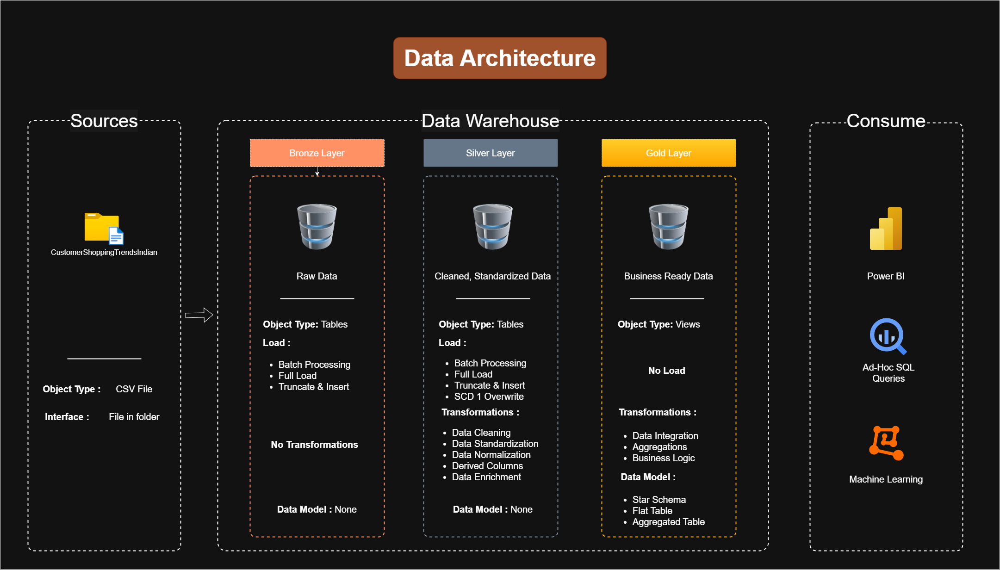
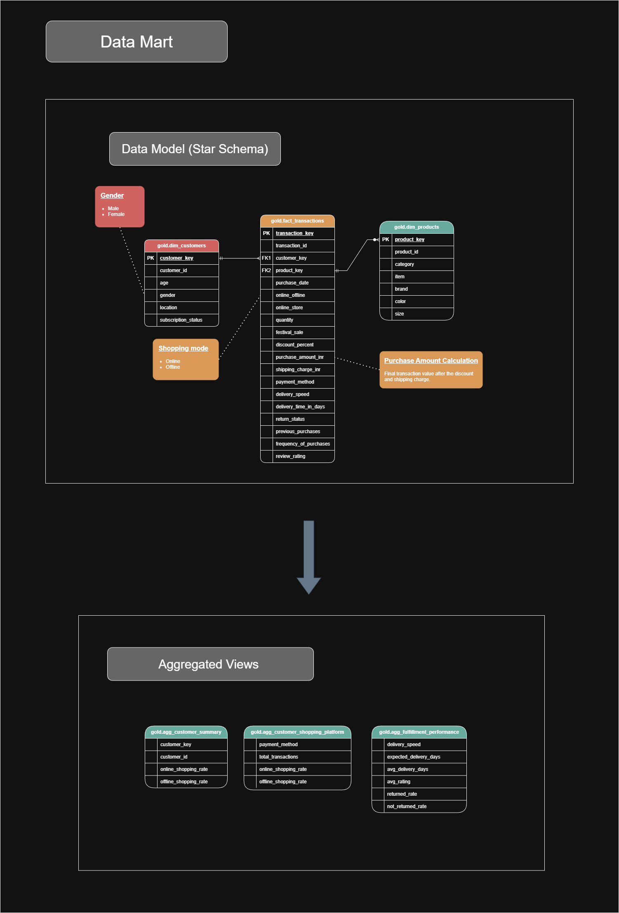
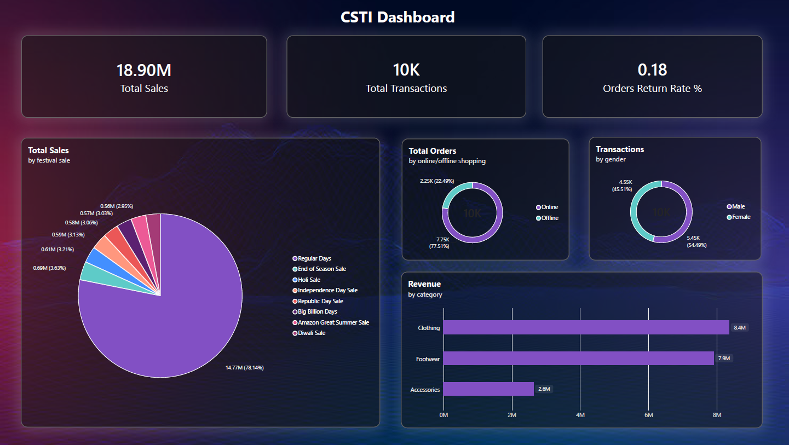

# Customer Shopping Trends in India - Data Warehouse & EDA Project

This project implements a **Data Warehouse** for analyzing customer shopping trends in India, following a **Kimball Dimensional Modeling** approach. The solution is built using **SQL Server** and demonstrates the complete ETL (Extract, Transform, Load) process from source tables to a dimensional model.

## 📂 Project Structure

```
sql-customer-shopping-trends-in-india-data-warehouse/
├── datasets/                    # Source data files
│   ├── customer_shopping_behavior.csv
│   ├── customer_shopping_behavior_renamed_columns.csv
├── dwh/docs/                        # Documentation
│   ├── naming_conventions.md           # Naming conventions used in this project
│   ├── data_architecture.png           # PNG image of data architecture
│   ├── data_flow.png                   # PNG image of data flow
│   ├── data_model.png                  # PNG image of data model
│   ├── data_catalog.md                 # Data catalog
├── dwh/scripts/                     # SQL & Python Orchestration scripts
│   ├── pipeline_runner.py              # Master Python Orchestrator & Data Quality Runner
│   ├── rename_columns.py               # Python script for renaming columns to standard format
│   ├── audit.etl_log.sql               # Audit schema and etl_log metadata table DDL
│   ├── bronze/
│   │   ├── ddl_bronze.sql              # DDL for bronze layer
│   │   └── proc_load_bronze.sql        # Stored procedure with audit logging for bronze layer
│   ├── silver/
│   │   ├── ddl_silver.sql              # DDL for silver layer
│   │   ├── proc_load_silver.sql        # Stored procedure with audit logging for silver layer
│   │   └── quality_checks_silver.sql   # Quality checks for silver layer
│   ├── gold/
│   │   ├── ddl_gold.sql                # DDL for gold layer
│   │   └── quality_checks_gold.sql     # Quality checks for gold layer
├── dwh/tests/                       # Automated quality test scripts
└── README.md
```

## 🏗️ Architecture


The project follows an enterprise **Three-Layer Medallion Architecture**:

1.  **Bronze Layer (Staging)**: Raw ingested data loaded via `proc_load_bronze` with row count and duration tracking.
2.  **Silver Layer (Cleaned)**: Transformed, cleansed, and standardized data loaded via `proc_load_silver`.
3.  **Gold Layer (Dimensional Model)**: Star schema (`dim_customers`, `dim_products`, `fact_transactions`) optimized for business analytics.
4.  **Audit Layer**: Dedicated `audit.etl_log` metadata table capturing process execution stats, record counts, execution duration, and failure error messages.

## Master Pipeline Orchestration & Data Quality

The pipeline is managed by an external Python master orchestrator (`pipeline_runner.py`):

```bash
python dwh/scripts/pipeline_runner.py
```

### Key Capabilities:
- **Automated CSV Preprocessing**: Standardizes raw column headers prior to SQL ingestion.
- **SQL Execution Control**: Triggers Bronze & Silver procedures automatically.
- **Data Quality Gateways**: Validates primary key uniqueness, null tolerances, and row count parity across layers before allowing pipeline completion.
- **Audit Logging**: Logs execution metadata to `audit.etl_log` for full pipeline observability.

## 📊 Data Flow


## 🔍 Data Model


### 🟤 Bronze Layer
- Column headers standardized using `rename_columns.py`.
- Bulk loaded into `bronze.csti_customer_shopping_behavior`.

### ⚪ Silver Layer
Cleanses strings, standardizes NULL values, parses dates/numerics, derives `delivery_speed`, and logs execution stats.

### 🟡 Gold Layer
- `dim_customers` - Customer details & demographics.
- `dim_products` - Product attributes & categories.
- `fact_transactions` - Granular purchasing transactions.
- `agg_customers_summary` - Customer aggregate shopping patterns.
- `agg_customer_shopping_platform` - Online vs offline shopping comparison.
- `agg_fulfillment_performance` - Fulfillment speed and delivery performance metrics.

## 📊 Dashboard Preview Using Power BI


Connected directly to the **Gold Layer** Star Schema (`fact_transactions`, `dim_customers`, `dim_products`), providing real-time executive visibility into:
- **Total Revenue & Order Volume**: Key KPI cards displaying ₹18.90M total revenue, 10K completed transactions and Products Return Rate in Percent.
- **Category Sales Breakdown**: Revenue distribution across Clothing, Footwear, and Accessories.
- **Gender-wise Sales**: Revenue distribution across Male and Female.
- **Shopping Mode Performance**: Online vs. Offline purchasing behavior analysis (77.5% Online / 22.5% Offline).

## 🛠️ Tech Stack
- **MS SQL Server** & SSMS
- **Python v3.14** (`pandas`, `pyodbc`)
- **Microsoft Power BI** (Dashboard Preview)
- **Draw.io** (Architectural & Dimensional Modeling Diagrams)