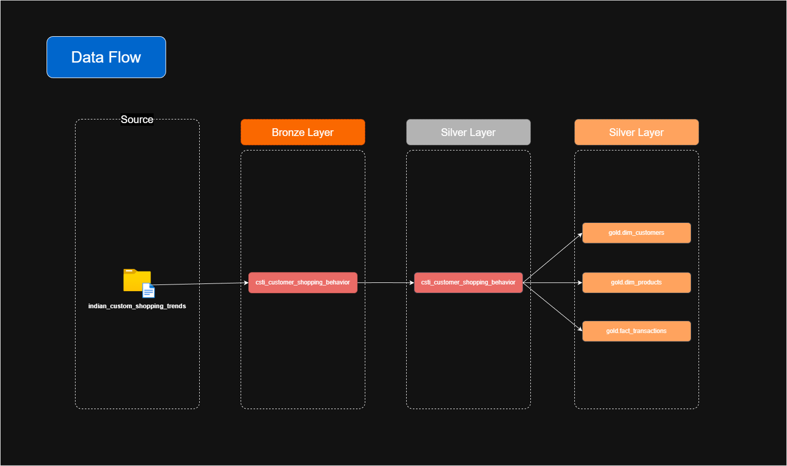

# Customer Shopping Trends in India - Data Warehouse Project

This project implements a **Data Warehouse** for analyzing customer shopping trends in India, following a **Kimball Dimensional Modeling** approach. The solution is built using **SQL Server** and demonstrates the complete ETL (Extract, Transform, Load) process from source tables to a dimensional model.

## 📂 Project Structure

```
sql-customer-shopping-trends-in-india-data-warehouse/
├── datasets/                    # Source data files
│   ├── customer_shopping_behavior.csv
│   ├── customer_shopping_behavior_renamed_columns.csv
├── docs/                        # Documentation
│   ├── naming_conventions.md           # Naming conventions which are used in this project
│   ├── data_architecture.drawio        # Draw.io file for data architecture
│   ├── data_architecture.png           # PNG image of data architecture
│   ├── data_flow.drawio                # Draw.io file for data flow
│   ├── data_flow.png                   # PNG image of data flow
│   ├── data_model.drawio               # Draw.io file for data model
│   ├── data_model.png                  # PNG image of data model
│   ├── data_catalog.md                 # Data catalog
├── scripts/                     # SQL scripts
│   ├── rename_columns.py               # Python script for renaming columns to standard format
│   ├── bronze
│   │   ├── ddl_bronze.sql              # DDL for bronze layer
│   │   └── proc_load_bronze.sql        # Stored procedure for loading data into bronze layer
│   ├── silver
│   │   ├── ddl_silver.sql              # DDL for silver layer
│   │   ├── proc_load_silver.sql        # Stored procedure for loading data into silver layer
│   │   └── quality_checks_silver.sql   # Quality checks for silver layer
│   ├── gold
│   │   ├── ddl_gold.sql                # DDL for gold layer
│   │   └── quality_checks_gold.sql     # Quality checks for gold layer
├── tests/                       # Test scripts
│   │   └── quality_checks_silver.sql   # Quality checks for silver layer
│   │   └── quality_checks_gold.sql     # Quality checks for gold layer
└── README.md
```

## 🏗️ Architecture


The project follows a **Three-Layer Architecture**:

1.  **Bronze Layer (Staging)**: Raw ingested data.
2.  **Silver Layer (Cleaned)**: Cleaned, normalized and standardized data.
3.  **Gold Layer (Dimensional Model)**: Star schema for analytics.

## 📊 Data Flow


## 🔍 Data Model


### 🟤 Bronze Layer
- The columns has been renamed using python script `rename_columns.py` before loading into the bronze layer.

- Raw data read via python script of `customer_shopping_behavior.csv` file and loaded into the bronze layer with a transformed column names as `customer_shopping_behavior_renamed_columns.csv` file.

### ⚪ Silver Layer
Performs Cleaning, Removing Empty and Duplicate Records and Data Standardization.

### 🟡 Gold Layer
- `dim_customers` - Provides the customers details.
- `dim_products` - Provides the products details.
- `fact_transactions` - Provides the transactions details.
- `agg_customers_summary` - Provides the customers details with their shopping summary.
- `agg_customer_shopping_platform` - Provides the customers shopping platform details to compare online and offline shopping preferences.
- `agg_fulfillment_performance` - Provides the fulfillment performance details on basis of delivery time and business logic standards.

## 🛠️ Tech Stack
- MS SQL Server 
- SQL Server Management Studio (SSMS) v22.1.0
- Python v3.14.5
- Draw.io v29.7.9